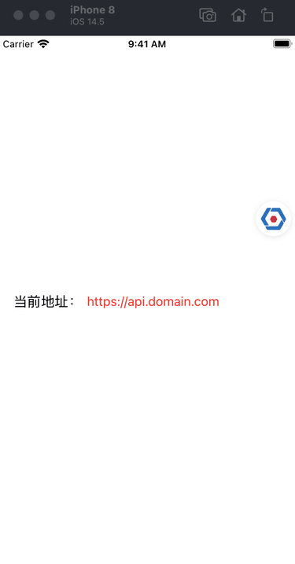
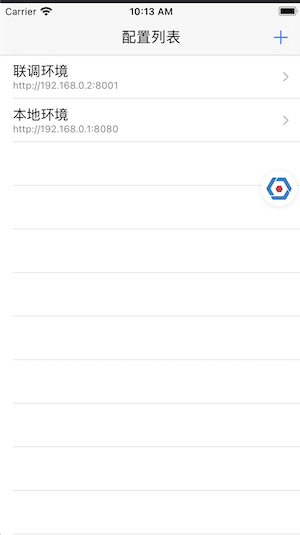
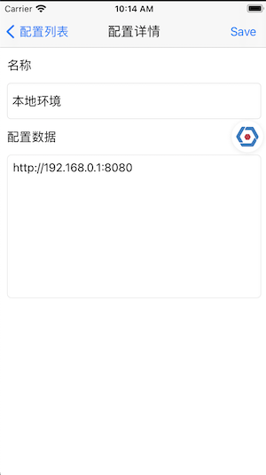

# DoraemonPlugins


## DoraemonKit插件

#### 示例图





### 要求

- Swift 5.0 / Objective-C
- Xcode 11
- iOS 9.0+

### 使用

------


```objective-c
//初始化DoraemonEnvPlugin
[DoraemonEnvPlugin installWithTitle:@"环境切换" icon:[UIImage imageNamed:@"icon_env"] desc:@"用于app内部环境切换" atModule:@"业务专区" handle:^(NSString * _Nonnull env, NSString * _Nonnull data) {
  //当环境变更时，会触发handle回调，你在这里修改相关的环境配置
  apiUrl = data; //比如修改接口地址
}];
//支持添加默认环境
[DoraemonEnvPlugin addDefaultEnv:@"正式环境" withData:@"https://api.domain.com"];
[DoraemonEnvPlugin addDefaultEnv:@"测试环境" withData:@"https://test-api.domain.com"];
```

### 集成

##### CocoaPods

```ruby
pod 'DoraemonPlugins'
```

##### Swift Package Manager

```swift
dependencies: [
    .package(url: "https://github.com/moliya/DoraemonPlugins", from: "1.2")
]
```

### License

DoraemonPlugins is released under the MIT license. See LICENSE for details.