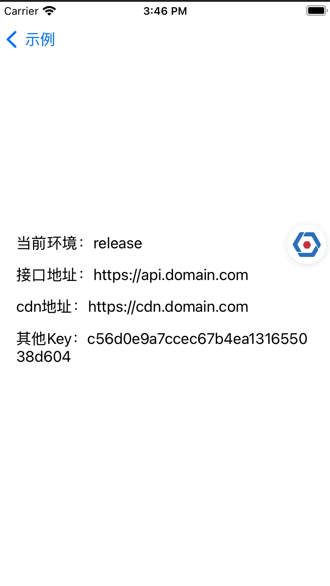
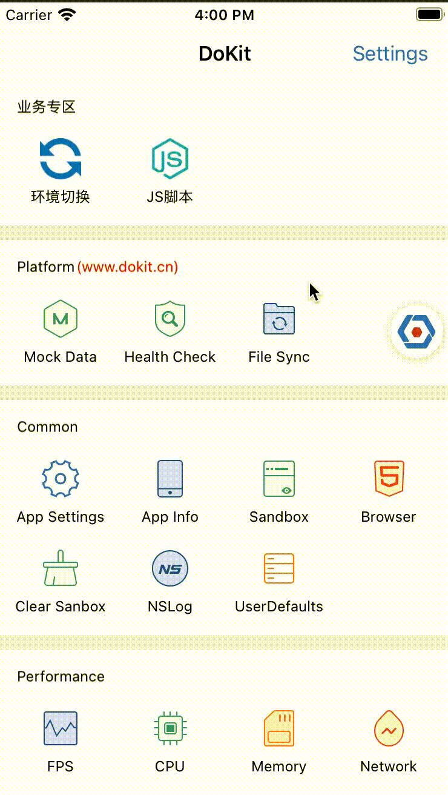
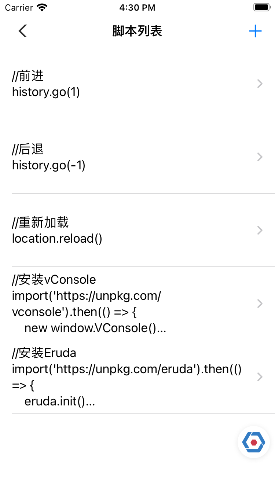
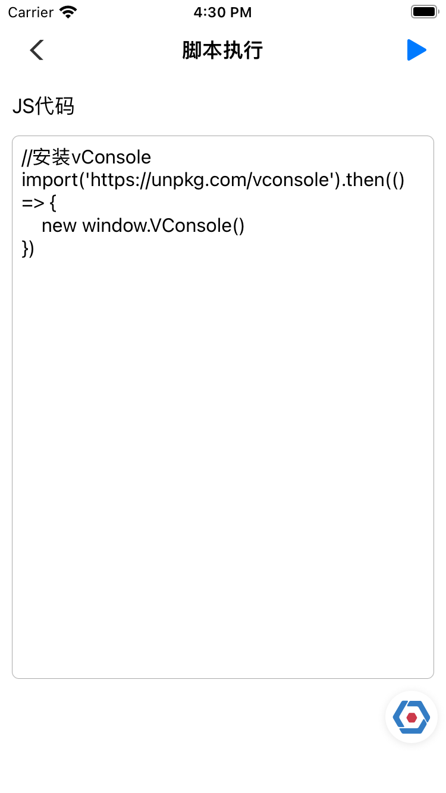

# DoraemonPlugins


## DoraemonKit插件

#### 示例图

* 环境切换插件

  用于app内部环境的切换

<div align="left"></div>

可以添加自定义环境

<div></div>

* JS脚本插件

  用于在webView执行JavaScript代码

  <div align="left"></div>

  <div></div>

### 要求

- Swift 5.0 / Objective-C
- Xcode 11
- iOS 9.0+

### 使用

------


```objective-c
//添加DoraemonEnvPlugin
[DoraemonEnvPlugin installWithTitle:@"环境切换" icon:[UIImage imageNamed:@"icon_env"] desc:@"用于app内部环境切换" atModule:@"业务专区" handle:^(NSString * _Nonnull env, NSString * _Nonnull data) {
  //当环境变更时，会触发handle回调，你在这里修改相关的环境配置
  apiUrl = data; //比如修改接口地址
}];
//支持添加默认环境
[DoraemonEnvPlugin addDefaultEnv:@"正式环境" withData:@"https://api.domain.com"];
[DoraemonEnvPlugin addDefaultEnv:@"测试环境" withData:@"https://test-api.domain.com"];

//添加DoraemonJavaScriptPlugin
[DoraemonJavaScriptPlugin installWithTitle:@"JS脚本" icon:[UIImage imageNamed:@"icon_js"] desc:@"用于在指定webView中执行JS代码" atModule:@"业务专区" handle:^(id  _Nullable result, NSError * _Nullable error) {
  //JS代码执行的返回结果
	NSLog(@"result: %@", result);
}];
```

### 集成

##### CocoaPods

```ruby
pod 'DoraemonPlugins'
```

##### Swift Package Manager

```swift
dependencies: [
    .package(url: "https://github.com/moliya/DoraemonPlugins", from: "1.2")
]
```

### License

DoraemonPlugins is released under the MIT license. See LICENSE for details.